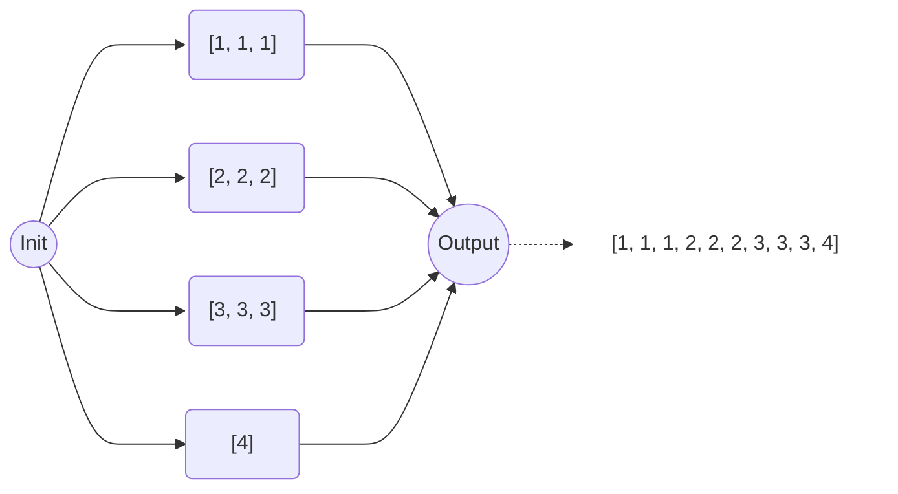

# A Python Parallel Builder on ArmoniK

## Description

This project contains a worker and a client to interact with ArmoniK's Control Plane. The worker processes tasks sent by the Agent, transforming input data and sending results back to it.

In this case, the aim is to build a list made up of segments created asynchronously. Given the length of the list and the length of the segments, the client creates an amount of tasks. Each of these will create its own segment and when this is done, the role of the output task is to aggregate all the segments and output the final list.

For example, if you choose a list and segments with respective lengths of 10 and 3, the pipeline will look like this:



## Steps

1. Build the Docker image for the worker:
    ```bash
    docker build -t parabuilder -f Dockerfile .
    ```

2. Deploy ArmoniK locally by following the instructions at [ArmoniK Documentation](https://aneoconsulting.github.io/ArmoniK/). Ensure you create a new partition named "parabuildpython" with the worker's image.

3. Create, activate a virtual environment and update useful dependencies:
    ```bash
    python -m venv .venv
    . .venv/bin/activate
    pip install -U pip setuptools
    ```

4. Install the dependencies and build the package:
    ```bash
    pip install .
    ```

## Usage

Run the Client with the name of the partition and the endpoint obtained after deployement. You have to specify the length of the final liste (-l) and the size of your segments (-s).

```bash
parabuild --partition parabuildpython --endpoint <ip>:<port> -s 100 -t 15
